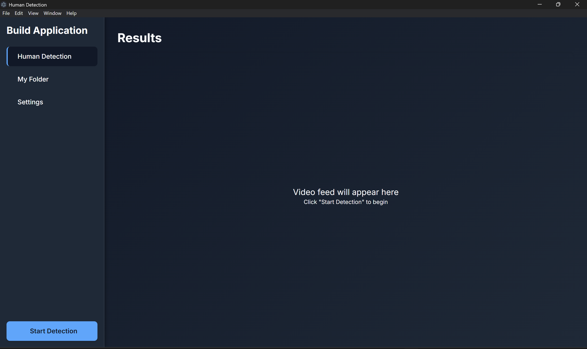

Real-Time Human Detection & Counting System
This application provides a real-time human detection and counting system using a live webcam feed. It is built with a Python back-end for computer vision processing and an Electron-based front-end for the user interface.

Features
Real-Time Detection: Utilizes the YOLOv8 model to detect and draw bounding boxes around humans in real-time.

Session Logging: Automatically logs each detection session, recording the date, time, max number of humans detected, and the duration of the session into a log_report.csv file.

Interactive UI: A clean user interface that allows starting and stopping the detection process.

Log Viewer: An integrated view to display and review past detection logs.

Theme Switching: Supports both light and dark themes for user comfort.

Modular Architecture: The computer vision logic (Python) is completely separate from the user interface (Electron), making the code easier to maintain and scale.

Tech Stack
Back-End: Python

Computer Vision: YOLOv8, OpenCV

Front-End GUI: Electron, HTML, CSS, JavaScript

Package Management: Node.js (npm), Pip

Setup and Installation
Follow these steps to get the application running on your local machine.

Prerequisites
Python 3.8+

Node.js (which includes npm)

1. Clone the Repository
git clone [https://github.com/your-username/your-repository-name.git](https://github.com/your-username/your-repository-name.git)
cd your-repository-name

2. Install Python Dependencies
Create a virtual environment (recommended) and install the required packages from requirements.txt.

# Create and activate a virtual environment (optional but good practice)
python -m venv venv
source venv/bin/activate  # On Windows, use `venv\Scripts\activate`

# Install dependencies
pip install -r requirements.txt

The YOLOv8 model weights (yolov8n.pt) will be downloaded automatically the first time you run the application.

3. Install Node.js Dependencies
This will install Electron and other necessary packages for the front-end.

npm install

Running the Application
Once the setup is complete, you can start the application with a single command:

npm start

This will launch the Electron window, and you can begin using the human detection system.